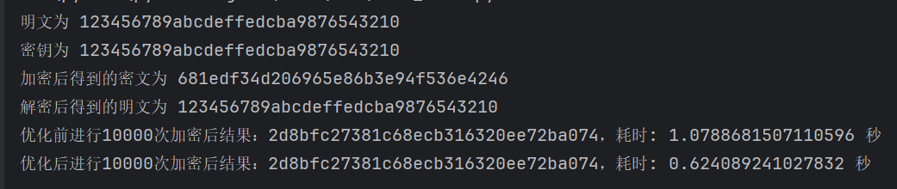
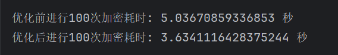

# SM4算法
## 轮函数F
   
### 轮函数的结构
	
输入为 $(X_0,X_{1},X_{2},X_{3})\in (Z_{2}^{32})^{4}$ ，轮密钥 $rk\in Z_{2}^{32}$ ，轮函数 $F$ 为

$$F(X_{0},X_{1},X_{2},X_{3},rk)=X_{0}\oplus T(X_{1}\oplus X_{2}\oplus X_{3}\oplus rk)$$

### 合成置换T

$T:Z_{2}^{32}\rightarrow Z_{2}^{32}$是个可逆变换，由非线性变换 $\tau$ 和线性变换 $L$ 复合而成，即 $T(\cdot)=L(\tau(\cdot))$
	
	
#### 非线性变换 $\tau$
	
由4个并行的S盒构成，设输入为 $A=(a_{0},a_{1},a_{2},a_{3})$ ，输出为 $B=(b_{0},b_{1},b_{2},b_{3})$ 。
	

$$(b_{0},b_{1},b_{2},b_{3})=\tau(A)=(Sbox(a_{0}),Sbox(a_{1}),Sbox(a_{2}),Sbox(a_{3}))$$

	
Sbox的数据见附录。
	
#### 线性变换 $L$
	
非线性变换 $\tau$ 的输出是线性变换$L$的输入。设输入为 $B\in Z_{2}^{32}$ ，输出为 $C\in Z_{2}^{32}$ 。

$$C=L(B)=B\oplus(B<<<2)\oplus(B<<<10)\oplus(B<<<18)\oplus(B<<<24)$$

## 算法描述
### 加密算法
加密算法由32次迭代运算和1次反序变换 $R$ 组成。
	
设明文输入为 $(X_{0},X_{1},X_{2},X_{3})\in (Z_{2}^{32})^{4}$ ，密文输出为 $(Y_{0},Y_{1},Y_{2},Y_{3})\in (Z_{2}^{32})^{4}$ ，轮密钥为 $rk_{i}\in Z_{2^{32}},i=0,1,2,\cdots,31$ 。
	
#### 32次迭代运算
	
	
$$X_{i+4}=F(X_{i},X_{i+1},X_{i+2},X_{i+3}),i=0,1,\cdots,31$$

	
#### 反序变换
	
	
$$(Y_{0},Y_{1},Y_{2},Y_{3})=R(X_{32},X_{33},X_{34},X_{35})=(X_{35},X_{34},X_{33},Y_{32})$$

	
### 解密算法
	
解密算法与加密算法结构相同，不同仅是轮密钥的使用顺序。解密时，使用轮密钥顺序 $(rk_{31},rk_{30},\cdots,rk_{0})$ 。
	
	
### 密钥扩展算法
加密过程使用的轮密钥由加密密钥生成，其中加密密钥 $MK=(MK_{0},MK_{1},MK_{2},MK_{3})\in(Z_{2}^{32})^{4}$ 。
	
	
$$(K_{0},K_{1},K_{2},K_{3})=(MK_{0}\oplus FK_{0},MK_{1}\oplus FK_{1},MK_{2}\oplus FK_{2},MK_{3}\oplus FK_{3})$$
		
$$rk_{i}=K_{i+1}=K_{i}\oplus T'(K_{i+1}\oplus K_{i+2}\oplus K_{i+3}\oplus CK_{i}),i=0,1,\cdots,31$$

#### 置换 $T'$
$T'$ 是将合成置换$T$的线性变换 $L$ 替换成 $L'$
	
	
$$L'(B)=B\oplus(B<<<13)\oplus(B<<<23)$$
	
	
#### 参数 $FK$
系统参数 $FK$ 的取值为:
	
	
$$FK_{0}=A3B1BAC6, FK_{1}=56AA3350, FK_{2}=677D9197, FK_{3}=B27022DC$$
	
#### 参数 $CK$
固定参数 $CK$ ，设 $ck_{i+j}$ 为 $CK_{i}$ 的第 $j$ 字节( $i=0,1,\cdots,31;j=0,1,2,3$ )，即 $CK_{i}=(ck_{i,0},ck_{i,1},ck_{i,2},ck_{i,3})\in (Z_{2}^{8})^{4}$ ，则 $ck_{i+j}=(4i+j)\times 7(mod 256)$
	
固定参数 $CK$ 具体值见附录。
	
	
# SM4查表优化
为了提升效率，可将S盒与后续的循环移位L进行合并
	
	
$$L(Sbox(a_{0}),Sbox(a_{1}),Sbox(a_{2}),Sbox(a_{3}))=L(Sbox(a_{0})<<24)\oplus L(Sbox(a_{1})<<16) \oplus L(Sbox(a_{2})<<8) \oplus L(Sbox(a_{3}))$$
	
	
根据上式，可定义4个 $8bits\rightarrow 32bits$ 查找表
	
$$
\begin{aligned}
T_{0}(a) &= L(Sbox(a) \ll 24) \\
T_{1}(a) &= L(Sbox(a) \ll 16) \\
T_{2}(a) &= L(Sbox(a) \ll 8) \\
T_{3}(a) &= L(Sbox(a))
\end{aligned}
$$

# SM4-GCM工作模式

## 加密流程

### 输入

密钥K + IV + 明文P + AAD

### 生成哈希子键 H

使用 SM4 算法加密 128 位全 0 数据，密钥为用户主密钥 K
$$H=SM4\_ encrypt（0^{128},K）$$

### 基于 IV 生成初始计数器 $j_{0}$

直接在 IV 后拼接 4 字节计数器初始值0x00000001。

$$j_{0}=IV||0x00000001$$

### CTR 模式加密

1. 从 $j_{0}$ 开始，每个块的计数器为 $j_{i}=j_{0}+i$ (i为块序号)

2. 对每个计数器值执行 SM4 加密， $S_{i} =SM4\_encrypt（j_{i},K） $

3. 明文块与流密钥异或得到密文， $C_{i}=S_{i}\oplus P_{i}$

### GHASH 计算认证哈希 T'

1. 将 AAD 和密文按 128 位分块，不足则补 0，AAD块 || 密文块 || $len(AAD)_{64}$ || $len(C)_{64}$

2.  $Y_{0}=0^{128}$ ，
对每个块执行：  $Y_{i}= (Y_{i-1} \oplus $ 块 $)$ × H（有限域 $GF (2^{128})$ 乘法），
最终结果为 T'

### 生成最终认证标签 T

$$T = SM4\_ encrypt(j_{0}, K) \oplus T'
$$

### 输出

（C,T）

## 解密流程
	
### 输入

密钥K + IV + 密文C + 标签 T + AAD

### 验证认证标签

1. 重新计算 T' 和预期标签 T (与加密时步骤相同)

2. 预期标签 T  $\neq$ T 则拒绝解密（数据篡改或密钥错误）。

### CTR 模式解密

1. 从 $j_{0}$ 开始，每个块的计数器为 $j_{i}=j_{0}+i$ (i为块序号)

2. 对每个计数器值执行 SM4 加密， $S_{i} =SM4\_encrypt（j_{i},K） $

3. 明文块与流密钥异或得到密文， $P_{i}=S_{i}\oplus C_{i}$

### 输出

P

# SM4-GCM工作模式的软件优化实现

使用查表优化 $GF(2^{128})$ 域中的计算， 每次计算都会计算和哈希值 $H$ 的乘法，因此可以使用查表法优化
	
# 实现结果
	
对于SM4算法的实现及其优化，如下图所示，加密之后再解密得到的明文和原来的明文一样，SM4算法实现成功。优化后的算法明显快于优化前，优化实现成功。

对于SM4-GCM工作模式的优化，如下图所示，优化后的算法快于优化前，优化实现成功。

# 附录

## SM4的S盒

| 行\列 | 0   | 1   | 2   | 3   | 4   | 5   | 6   | 7   | 8   | 9   | A   | B   | C   | D   | E   | F   |
|-------|-----|-----|-----|-----|-----|-----|-----|-----|-----|-----|-----|-----|-----|-----|-----|-----|
| 0     | D6  | 90  | E9  | FE  | CC  | E1  | 3D  | B7  | 16  | B6  | 14  | C2  | 28  | FB  | 2C  | 05  |
| 1     | 2B  | 67  | 9A  | 76  | 2A  | BE  | 04  | C3  | AA  | 44  | 13  | 26  | 49  | 86  | 06  | 99  |
| 2     | 9C  | 42  | 50  | F4  | 91  | EF  | 98  | 7A  | 33  | 54  | 0B  | 43  | ED  | CF  | AC  | 62  |
| 3     | E4  | B3  | 1C  | A9  | C9  | 08  | E8  | 95  | 80  | DF  | 94  | FA  | 75  | 8F  | 3F  | A6  |
| 4     | 47  | 07  | A7  | FC  | F3  | 73  | 17  | BA  | 83  | 59  | 3C  | 19  | E6  | 85  | 4F  | A8  |
| 5     | 68  | 6B  | 81  | B2  | 71  | 64  | DA  | 8B  | F8  | EB  | 0F  | 4B  | 70  | 56  | 9D  | 35  |
| 6     | 1E  | 24  | 0E  | 5E  | 63  | 58  | D1  | A2  | 25  | 22  | 7C  | 3B  | 01  | 21  | 78  | 87  |
| 7     | D4  | 00  | 46  | 57  | 9F  | D3  | 27  | 52  | 4C  | 36  | 02  | E7  | A0  | C4  | C8  | 9E  |
| 8     | EA  | BF  | 8A  | D2  | 40  | C7  | 38  | B5  | A3  | F7  | F2  | CE  | F9  | 61  | 15  | A1  |
| 9     | E0  | AE  | 5D  | A4  | 9B  | 34  | 1A  | 55  | AD  | 93  | 32  | 30  | F5  | 8C  | B1  | E3  |
| A     | 1D  | F6  | E2  | 2E  | 82  | 66  | CA  | 60  | C0  | 29  | 23  | AB  | 0D  | 53  | 4E  | 6F  |
| B     | D5  | DB  | 37  | 45  | DE  | FD  | 8E  | 2F  | 03  | FF  | 6A  | 72  | 6D  | 6C  | 5B  | 51  |
| C     | 8D  | 1B  | AF  | 92  | BB  | DD  | BC  | 7F  | 11  | D9  | 5C  | 41  | 1F  | 10  | 5A  | D8  |
| D     | 0A  | C1  | 31  | 88  | A5  | CD  | 7B  | BD  | 2D  | 74  | D0  | 12  | B8  | E5  | B4  | B0  |
| E     | 89  | 69  | 97  | 4A  | 0C  | 96  | 77  | 7E  | 65  | B9  | F1  | 09  | C5  | 6E  | C6  | 84  |
| F     | 18  | F0  | 7D  | EC  | 3A  | DC  | 4D  | 20  | 79  | EE  | 5F  | 3E  | D7  | CB  | 39  | 48  |

## SM4算法系统参数 $CK_i$

| i  | $CK_i$      | i  | $CK_i$      | i  | $CK_i$      | i  | $CK_i$     |
|----|-----------|----|-----------|----|-----------|----|-----------|
| 0  | A3B1BAC6  | 1  | 56AA3350  | 2  | 677D9197  | 3  | B27022DC  |
| 4  | D014F9A8  | 5  | C7C3DF06  | 6  | B6A899B2  | 7  | F6FA0FAD  |
| 8  | B7A3DE73  | 9  | D1310BA6  | 10 | 98DFB5AC  | 11 | 2FFD72DB  |
| 12 | D01ADFB7  | 13 | B8E1AFED  | 14 | 6A2FADF5  | 15 | B9A92723  |
| 16 | 6D80E4A3  | 17 | BDA9CB7A  | 18 | 63030CA6  | 19 | 15188B1B  |
| 20 | 2C0BBD09  | 21 | D58A0B87  | 22 | 1830F50E  | 23 | 0EC6E0E8  |
| 24 | 79CCE593  | 25 | 5B537E34  | 26 | 6436970C  | 27 | 70988C82  |
| 28 | 71F241F0  | 29 | 158F9222  | 30 | 163FAD59  | 31 | 3405F97F  |