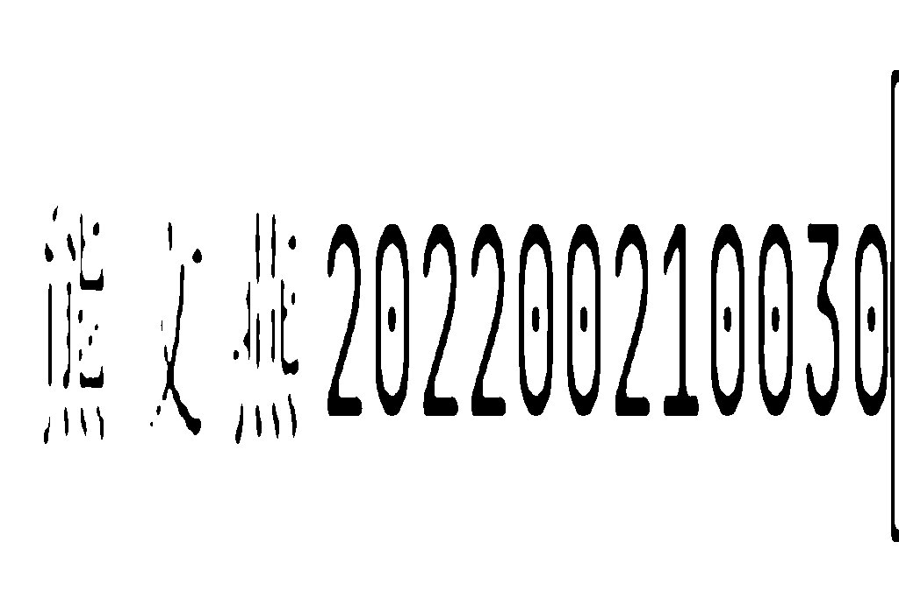
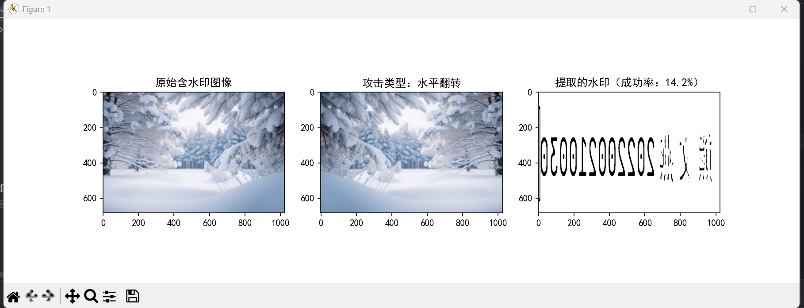
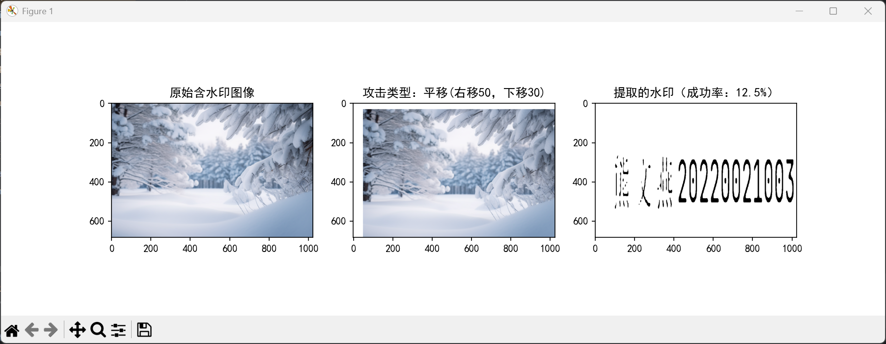

# 图片水印嵌入和提取

以下是基于LSB(最低有效位)的数字水印嵌入和提取过程

##  水印嵌入

提取水印图片并将其改成灰度图像，将被插入水印的原始图像提取成RGB图像

    copyright_image = Image.open(copyright_image_path).convert("L")  
    original_image = Image.open(original_image_path).convert("RGB")

调整水印图片尺寸与原始图像一致，并转化成numpy数组
    
    copyright_image = copyright_image.resize(original_image.size)
    original_array = np.array(original_image, dtype=np.uint8)
    copyright_array = np.array(copyright_image, dtype=np.uint8)

创建水印图片的副本，并且将其二值化，将水印的r通道的最后1bit置零，并且确保尺寸完全一致

    watermark = original_array.copy()
    copyright_binary = np.where(copyright_array < 128, 1, 0)
    watermark_r = watermark[:, :, 0]
    watermark_r = (watermark_r // 2) * 2 
    assert watermark_r.shape == copyright_binary.shape, "尺寸不匹配"

添加水印信息到R通道的最后1bit，并且确保值在0-255范围内并转换回uint8，最后更新水印图的R通道，然后转换回PIL图像并返回图像
    
    watermark_r = watermark_r + copyright_binary
    watermark_r = np.clip(watermark_r, 0, 255).astype(np.uint8)
    watermark[:, :, 0] = watermark_r
    watermarked_image = Image.fromarray(watermark)

## 图片提取

将具有水印的图片转换成RGB图像，然后转化成numpy数组，提取R通道的最后1bit，最后转换为二值图像，并返回

    watermarked_image = Image.open(watermarked_image_path).convert("RGB")
    watermarked_array = np.array(watermarked_image)
    extracted = (watermarked_array[:, :, 0] % 2) * 255
    extracted_image = Image.fromarray(extracted.astype(np.uint8))

## 实验结果

水印图片

原始图片

嵌入水印后的图片，和原始图片基本没区别，无法用肉眼区分

提取的水印图片，和水印图片类似，仅仅是颜色不同

# 鲁棒性测试

对嵌入水印的图片进行鲁棒性测试，包括翻转、平移、截取、调对比度。

水平翻转，水印提取成功率 14.2%

垂直翻转，水印提取成功率 14.2%

平移(右移50，下移30)，水印提取成功率 12.5%

截取中心50%区域，水印提取成功率 30.2%

对比度增强1.5倍，水印提取成功率 92.7%

对比度减弱0.5倍，水印提取成功率 98.6%

