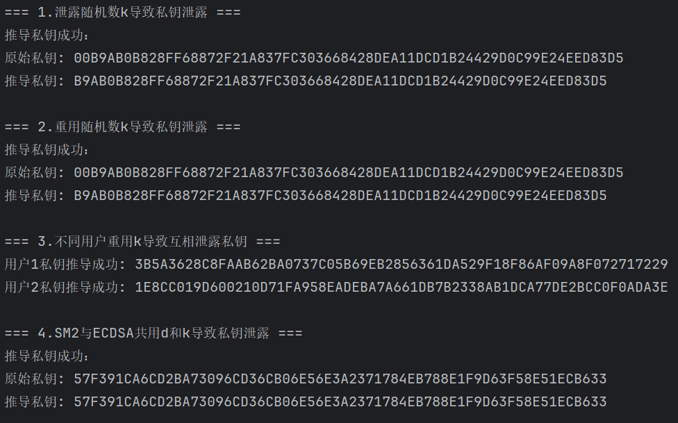
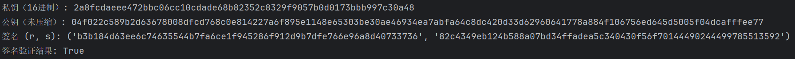

# SM2签名算法的误用

## 泄露随机数 k 导致私钥 d 泄露

### 推导

SM2 签名公式： $s=((1+d)^{-1}\cdot (k-r\cdot d))\ mod\ n$

可以得到 $s\cdot (1+d) = (k-r\cdot d)\ mod\ n \Rightarrow s+ s\cdot d+ r\cdot d = k\ mod\ n$

那么 $d\cdot (s+r) = k-s\ mod\ n\Rightarrow d=(k-s)\cdot (s+r)^{-1}\ mod\ n$

得到签名 $(r,s)$ 和随机数 $k$ ，可直接计算私钥 $d$

## 重用随机数k导致私钥d泄露

### 推导

对消息 $M_{1}$ 和 $M_{2}$ 重复使用 $k$ ，生成签名 $(r_{1},s_{1})$ 和 $(r_{2},s_{2})$

$$s_{1}\cdot (1+d) = (k-r_{1}\cdot d)\ mod\ n$$

$$s_{2}\cdot (1+d) = (k-r_{2}\cdot d)\ mod\ n$$

两式相减 $(s_{1}-s_{2})\cdot (1+d) = (r_{2}-r_{1})\cdot d\ mod\ n$

可以得到 $d=(s_{2}-s_{1})\cdot (s_{1}-s_{2}+r_{1}-r_{2})^{-1}\ mod\ n$

## 不同用户重用k导致互相泄露私钥

### 推导

用户A（私钥 $d_{1}$ ）和用户B（私钥 $d_{2}$ ）重复使用 $k$ ， 分别生成签名  $(r_{1},s_{1})$ 和 $(r_{2},s_{2})$

$$s_{1}\cdot (1+d_{1}) = (k-r_{1}\cdot d_{1})\ mod\ n$$

$$s_{2}\cdot (1+d_{2}) = (k-r_{2}\cdot d_{2})\ mod\ n$$

可以得到 

$$d_{1} = (k-s_{1})\cdot (s_{1}+r_{1})^{-1}\ mod\ n$$

$$d_{2} = (k-s_{2})\cdot (s_{2}+r_{2})^{-1}\ mod\ n$$

## SM2 与 ECDSA 共用d和k导致d泄露

### 推导

ECDSA签名： $s_{1}=k^{-1}\cdot (e+r_{1}\cdot d)\ mod\ n$

SM2 签名： $s_{2}=((1+d)^{-1}\cdot (k-r_{2}\cdot d))\ mod\ n$

可以得到 $d = (s_{1}\cdot s_{2}-e)\cdot (r_{1}-s_{1}\cdot s_{2}-s_{1}\cdot r_{2})^{-1}\ mod\ n$

## 验证结果

实验结果显示上述四个证明均正确

# 伪造中本聪的数字签名

使用 ECDSA（椭圆曲线数字签名算法），并且基于 secp256k1 椭圆曲线

## 密钥生成

1. 选择椭圆曲线 secp256k1（比特币标准）

2. 生成私钥 $d$ 

3. 计算公钥 $Q$

## 签名生成

1. 计算消息哈希 $e$ ， 对消息 $m$ 进行哈希 $e=SHA-256(m)$

2. 生成随机数 $k$

3. 计算椭圆曲线点 $(x_{1},y_{2})= k\times G$
 
4. 计算 $r=x_{1}\ mod\ n$ ， 若 $r=0$ 则重新选择 $k$

5. 计算 $s=k^{-1}\cdot (e+r\cdot d)\ mod\ n$ ， 若 $s=0$ 则重新选择 $k$

6. 返回签名 $(r,s)$

## 签名验证

1. 验证 $r,s$ 是否为正确的范围

2. 计算消息哈希  $e=SHA-256(m)$

3. 计算 $w=s^{-1}\ mod\ n$
 
4. 计算 $u_{1} = e\cdot w\ mod\ n$ 和 $u_{2} = r\cdot w\ mod\ n$

5. 计算椭圆曲线点 $(x_{1},y_{1})=u_{1}\times G + u_{2}\times Q$

6. 验证 $r=x_{1}\ mod\ n$

## 实验结果

实现成功

