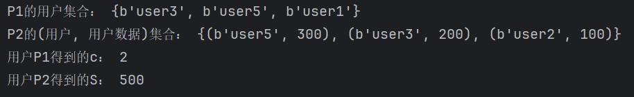

# DDH-based Private Intersection-Sum 协议

协议旨在实现两个参与方（ $P_{1}$ 和  $P_{2}$ ）在保护隐私的前提下，计算双方数据集交集的大小（基数）和交集中元素关联值的总和。

## 参与方与输入

- **P1(Party 1)**：拥有数据集 $V=\{v_{1},v_{2},\cdots ,v_{m1}\}$ ， $v_{i}$ 是用户的标识符
- **P2(Party 2)**：拥有数据集 $W=\{(w_{1},t_{1}),(w_{2},t_{2}),\cdots ,(w_{m2},t_{m2})\}$ ， $w_{i}$ 是用户的标识符 ， $t_{i}$ 是与 $w_{i}$ 关联的整数
- **目标**： $P_{1}$ 和  $P_{2}$ 共同计算：
  - 交集基数 $c=|\{w_{i}\in W|w_{i}\in V\}|$ 

  - 交集总和 $S=\sum_{w_{i}\in V\cap W}t_{i}$

## 协议前置条件

- **密码学原语**：
  - 一个满足DDH假设的有限群 $G$ ，其阶为素数 $n$ 。
  - 哈希函数 $H$ ： $U\rightarrow G$（ $U$ 是标识符空间），建模为随机预言机
  - 加法同态加密方案：支持密文加法 $AEnc(m_{1})+ AEnc(m_{2})=AEnc(m_{1}+m_{2})$

- **初始化参数**：
  - $P_{1}$ 随机生成私钥 $k_{1}\in [1,n-1]$
  - $P_{2}$ 随机生成私钥 $k_{2}\in [1,n-1]$ ，并生成同态加密密钥对 $(pk.sk)$ ， 公钥 $pk$ 发送给 $P_{1}$

## 协议实现流程

###  Round1

下述步骤由 $P_{1}$ 执行

- 对每个 $v_{i}\in V$ ，计算哈希值 $H(v_{i})$
- 用私钥 $k_{1}$ 对哈希值进行加密： $H(v_{i})^{k_{1}}$
- 将所有的  $H(v_{i})^{k_{1}}$ 打乱顺序发送给 $P_{2}$

###  Round2
下述步骤由 $P_{2}$ 执行
- **处理收到的集合** ：将所有的  $H(v_{i})^{k_{1}}$ ，使用私钥 $k_{2}$ 二次加密：  $(H(v_{i})^{k_{1}})^{k_{2}}$ ， 将结果打乱顺序，形成集合 $Z=\{H(v_{i})^{k_{1}\cdot k_{2}}\}$ 
- **处理自己的集合**：
  
  对每个 $(w_{i},t_{i})\in W$ 
  - 计算哈希值 $H(w_{i})$
  - 用私钥 $k_{2}$ 对哈希值进行加密： $H(w_{i})^{k_{2}}$
  - 用同态加密公钥 $pk$ 加密 $t_{i}$ ： $AEnc(t_{i})$ 
  - 将 $\{(H(w_{i})^{k_{2}},AEnc(t_{i}))\}$ 打乱顺序
- $P_{2}$ 将 $Z$ 和 $\{(H(w_{i})^{k_{2}},AEnc(t_{i}))\}$ 发送给 $P_{1}$

###  Round3
下述步骤由 $P_{1}$ 执行

- **识别交集元素**：对于每个 $(H(w_{i})^{k_{2}},AEnc(t_{i}))$ ， 使用私钥 $k_{1}$ 二次加密：  $(H(w_{i})^{k_{2}})^{k_{1}}$ ， 检查是否在 $Z$ 中，若在，则 $w_{i}\in V\cap W$
- **计算加密的交集总和**：
  收集所有交集中元素的密文 $AEnc(t_{i})$ ，利用同态加密的加法性质，计算总和的密文， $AEnc(S)=\sum_{w_{i}\in V\cap W}AEnc(t_{i})$ ， 对密文进行随机化
- **计算交集基数**：
  统计交集中元素的数量 $c$ 

- $P_{1}$ 将 $AEnc(S)$  发送给 $P_{2}$ ， 双方均可获取 $c$
###  Round4

$P_{2}$ 使用私钥 $sk$ 解密 $AEnc(S)$ ， 得到交集总和 $S$

## 实验结果
实验得到结果与预期结果相同，实现成功
